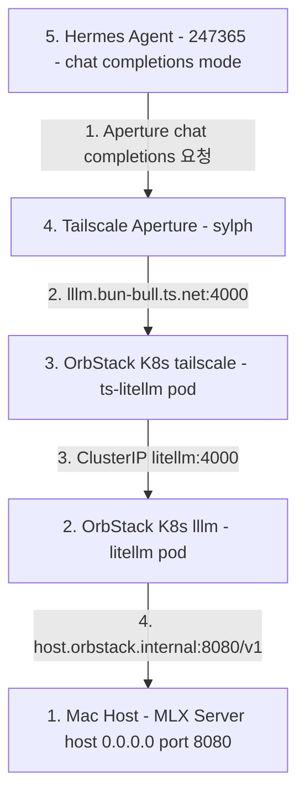

# MLX Gemma 4 26B QAT Integration Design

MLX 기반 `google/gemma-4-26b-a4b-qat` (MLX Checkpoint: `mlx-community/gemma-4-26b-a4b-it-4bit`) 모델을 로컬 Mac에서 구동하고, OrbStack K8s의 LiteLLM (`lllm`) 프록시 및 Tailscale Aperture (`sylph`)를 거쳐 Hermes Agent (`247365`)에서 활용하는 시스템 설계 문서입니다.

## Architecture



## 4-Phase Phased Implementation and Verification Plan

이 구현은 반드시 아래 4단계 순서대로 진행하며, 각 단계마다 명시된 검증 기준(Verification Gate)을 통과한 후 다음 단계로 진입합니다.

### Phase 1: MLX Local Server Setup - Mac Host

- 작업:
  - Mac 호스트에서 `mlx_lm.server`를 실행하여 K8s 파드 접근이 가능하도록 `--host 0.0.0.0` 바인딩 적용.
  - 실행 명령어:
    ```bash
    mlx_lm.server --model mlx-community/gemma-4-26b-a4b-it-4bit --host 0.0.0.0 --port 8080
    ```
- 검증 기준 (Verification Gate 1):
  - `curl http://localhost:8080/v1/models` 모델 조회 확인.
  - `POST /v1/chat/completions` 실제 추론(Inference) 및 스트리밍 응답 정상 동작 검증.

### Phase 2: LiteLLM Proxy Integration - lllm Repository and K8s

- 작업:
  - `lllm` 레포지토리의 `compose/litellm/config.yaml` 및 `k8s/configmap.yaml`에 모델 정의 추가:
    ```yaml
    - model_name: google/gemma-4-26b-a4b-qat
      litellm_params:
        model: openai/mlx-community/gemma-4-26b-a4b-it-4bit
        api_base: http://host.orbstack.internal:8080/v1
        api_key: sk-dummy
    ```
  - K8s 환경에 ConfigMap 반영 및 Deployment 재시작:
    `kubectl --context orbstack apply -k k8s/ && kubectl --context orbstack rollout restart deployment litellm -n lllm`
- 검증 기준 (Verification Gate 2):
  - `curl http://lllm.bun-bull.ts.net:4000/v1/models -H "Authorization: Bearer sk-litellm-20260516"` 모델 조회 확인.
  - LiteLLM을 통한 `POST http://lllm.bun-bull.ts.net:4000/v1/chat/completions` 실제 추론 검증.

### Phase 3: Tailscale Aperture Integration - sylph Repository

- 작업:
  - `sylph` 레포지토리의 `aperture/config.json` 내 `ZAI-openai` 또는 `MLX-openai` (baseurl: `http://lllm:4000`) provider 모델 목록에 `google/gemma-4-26b-a4b-qat` 추가.
  - Aperture 서비스 설정 반영 및 권한 확인.
- 검증 기준 (Verification Gate 3):
  - Tailscale Aperture 게이트웨이 엔드포인트를 통한 `google/gemma-4-26b-a4b-qat` 모델 `POST /v1/chat/completions` 호출 및 응답 검증.

### Phase 4: Hermes Agent Integration - 247365 Repository

- 작업:
  - `247365` 레포지토리의 Hermes Agent 설정에서 OpenAI `chat_completions` 프로토콜 기반 Aperture 엔드포인트 및 모델 ID `google/gemma-4-26b-a4b-qat` 지정:
    ```yaml
    model:
      default: google/gemma-4-26b-a4b-qat
      provider: custom:aperture-mlx
    custom_providers:
      - name: aperture-mlx
        base_url: http://ai/v1
        api_mode: chat_completions
    ```
- 검증 기준 (Verification Gate 4):
  - Hermes Agent에서 `google/gemma-4-26b-a4b-qat` 모델을 사용한 멀티턴 대화, 툴 호출(Tool Call) 및 최종 태스크 수행 완결 검증.

## Risk Management

- **MLX 메모리 이슈**: Gemma 4 26B 4-bit 모델 구동 시 Mac 메모리 모니터링.
- **OrbStack Host 접근 네트워크 이슈**: `host.orbstack.internal` 호스트명이 작동하지 않을 경우 Mac의 Tailscale IP 주소로 `api_base` 전환.
- **프로토콜 일치**: Hermes Agent가 Anthropic protocol (`/v1/messages`) 대신 OpenAI Chat Protocol (`/v1/chat/completions`)을 사용하는지 필수 확인.
