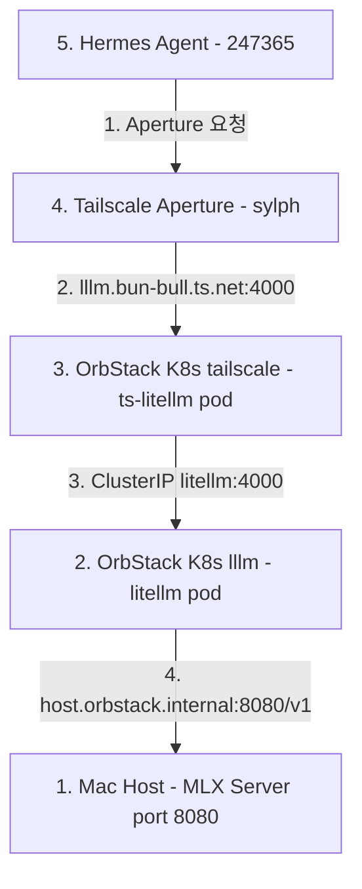

# MLX Gemma 4 26B QAT Integration Design

MLX 기반 google/gemma-4-26b-a4b-qat 모델을 로컬 Mac에서 구동하고, OrbStack K8s의 LiteLLM (lllm) 프록시 및 Tailscale Aperture (sylph)를 거쳐 Hermes Agent (247365)에서 활용하는 시스템 설계 문서입니다.

## Architecture



## 4-Phase Phased Implementation and Verification Plan

이 구현은 반드시 아래 4단계 순서대로 진행하며, 각 단계마다 명시된 검증 기준(Verification Gate)을 통과한 후 다음 단계로 진입합니다.

### Phase 1: MLX Local Server Setup - Mac Host

- 작업:
  - Mac 호스트에서 mlx_lm.server를 실행하여 google/gemma-4-26b-a4b-qat 모델을 8080 포트로 구동.
  - 실행 명령어: `mlx_lm.server --model google/gemma-4-26b-a4b-qat --port 8080`
- 검증 기준 (Verification Gate 1):
  - `curl http://localhost:8080/v1/models` 및 `curl http://localhost:8080/v1/chat/completions` 정상 응답 확인.

### Phase 2: LiteLLM Proxy Integration - lllm Repository and K8s

- 작업:
  - lllm 레포지토리의 compose/litellm/config.yaml 및 k8s/configmap.yaml에 모델 정의 추가:
    ```yaml
    - model_name: google/gemma-4-26b-a4b-qat
      litellm_params:
        model: openai/google/gemma-4-26b-a4b-qat
        api_base: http://host.orbstack.internal:8080/v1
        api_key: sk-dummy
    ```
  - K8s 환경에 ConfigMap 반영 및 Deployment 재시작:
    `kubectl --context orbstack apply -k k8s/ && kubectl --context orbstack rollout restart deployment litellm -n lllm`
- 검증 기준 (Verification Gate 2):
  - `curl http://lllm.bun-bull.ts.net:4000/v1/models -H "Authorization: Bearer sk-litellm-20260516"` 응답에 google/gemma-4-26b-a4b-qat 모델 포함 여부 확인.

### Phase 3: Tailscale Aperture Integration - sylph Repository

- 작업:
  - sylph 레포지토리의 aperture/config.json 내 ZAI-openai 또는 MLX-openai (baseurl: http://lllm:4000) provider 모델 목록에 google/gemma-4-26b-a4b-qat 추가.
  - Aperture 서비스 설정 반영 및 권한 확인.
- 검증 기준 (Verification Gate 3):
  - Tailscale Aperture 게이트웨이 엔드포인트를 통한 google/gemma-4-26b-a4b-qat 모델 호출 및 응답 검증.

### Phase 4: Hermes Agent Integration - 247365 Repository

- 작업:
  - 247365 레포지토리의 Hermes Agent 환경변수/설정 파일에서 Aperture 엔드포인트 및 모델 ID google/gemma-4-26b-a4b-qat 지정.
- 검증 기준 (Verification Gate 4):
  - Hermes Agent에서 google/gemma-4-26b-a4b-qat 모델을 사용한 멀티턴 대화 및 에이전트 태스크 수행 정상 동작 검증.

## Risk Management

- MLX 메모리 이슈 발생 시 Mac 메모리 모니터링 및 batch 크기 조정.
- OrbStack Host 접근 실패 시 host.orbstack.internal 대신 Mac의 Tailscale IP 주소로 api_base 전환.
